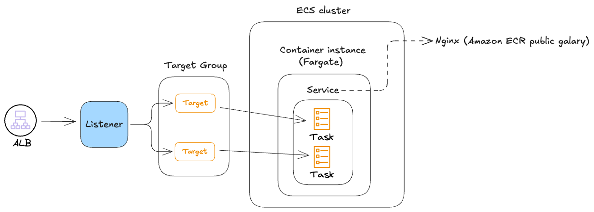

# Projects 

## Connecting an EC2 instance to S3

## Deploying your application using ECS Fargate and ALB

## Deploying your application using ECS with ASG provider

## Fargate with S3 access and scheduling via cloud watch